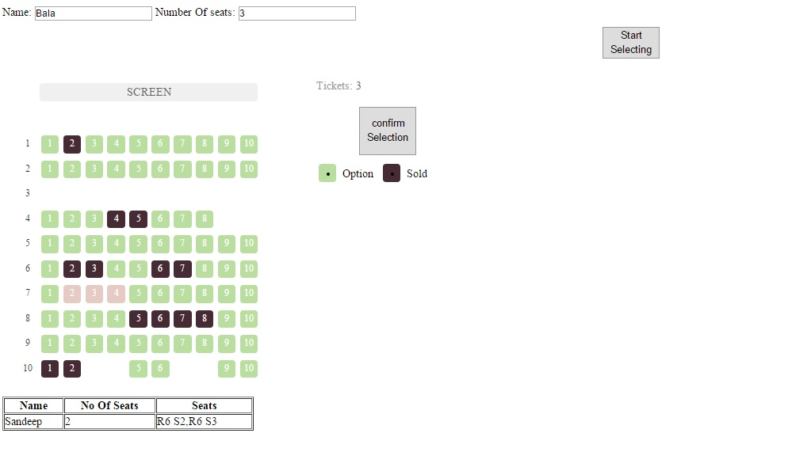

# bookmovies

The project is a demo to display usage of Emberjs with dummy node express.

To run the project please follow below commands in the extracted/cloned code

```
npm install

npm start
```

This would start server on port 3000, we can visit the dashboard page in browser at location http://localhost:3000



